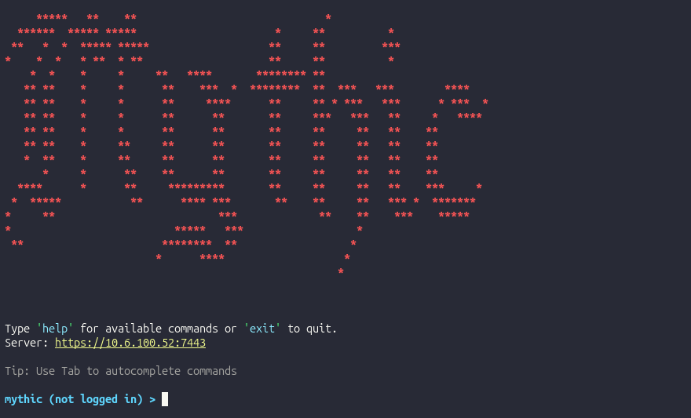
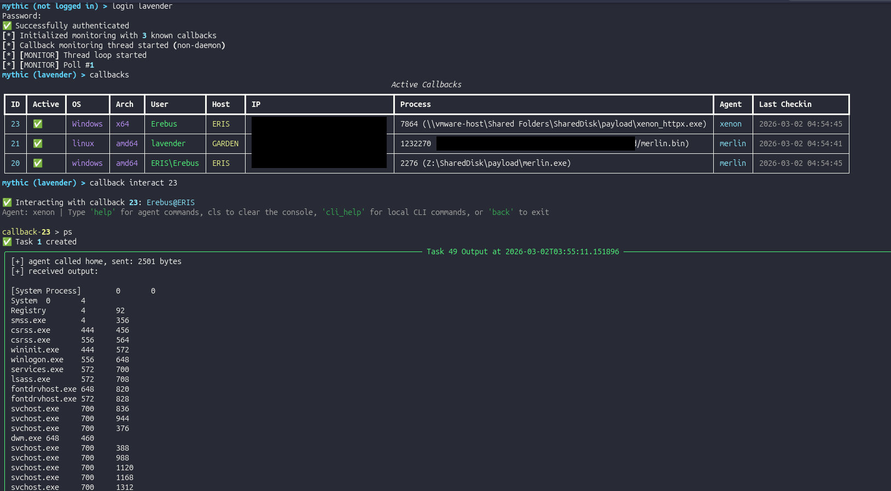
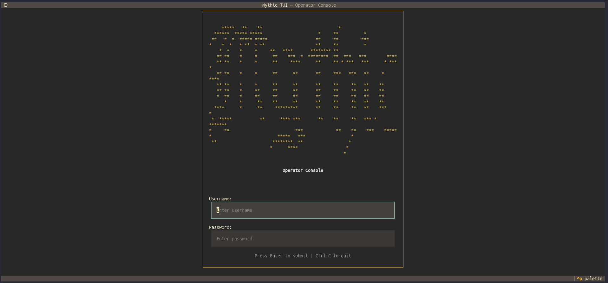
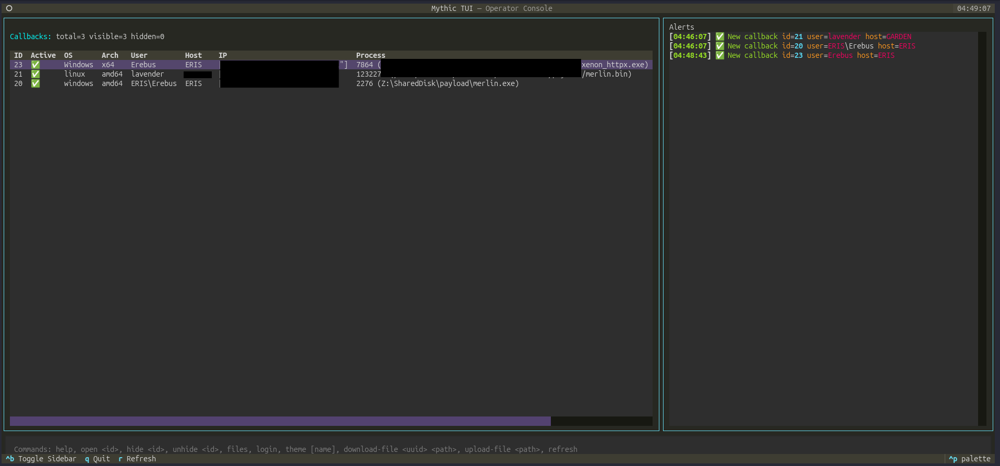
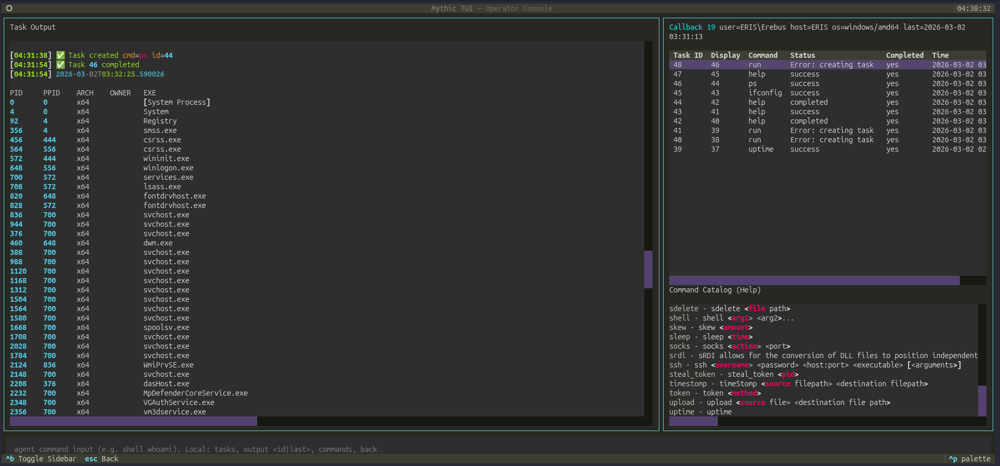

# Mythic-cli
A CLI and TUI Tool to interact with the [Mythic C2 Framework](https://github.com/its-a-feature/Mythic).

## Disclaimer

This project is intended for educational and authorized use only. The authors are not responsible for any misuse or damage caused by this software. Always ensure you have proper authorization before using this tool in any environment.

Note: This project is in early development and may contain bugs or incomplete features. Use with caution and report any issues you encounter. The project also understands that there are limitations with what the Mythic API can do, and some features may require Mythic Web UI interaction to complete certain tasks.

## Features
### Mythic CLI
- Fully featured command-line interface for interacting with Mythic's API
- Supports all major Mythic operations: managing agents, tasks, files, etc.
- Interactive mode for step-by-step command execution




### Mythic TUI
- Text-based user interface built with Textual for a more visual experience
- Real-time updates on agents, tasks, and files
- Integrated command input with output display





## Installation

```bash
pipx install git+https://github.com/Whisperlabs/Mythic-cli.git
```

## Usage

```bash
mythic-cli # Starts the CLI interface
mythic-tui # Starts the TUI interface
```

## Contributing
Contributions are welcome! Please fork the repository and submit a pull request with your changes. For major changes, please open an issue first to discuss what you would like to change.

## License
This project is licensed under the BSD 2-Clause - see the [LICENSE](LICENSE) file for details